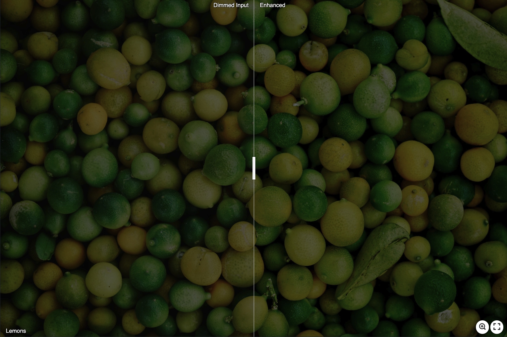

# ENG-CNN
 ENG-CNN: A CNN - Based Approach for Energy-Preserving Image Enhancement

 # Output results
 ## Lemons
 ###  Comparison between the dimmed input and the enhanced output/ the DCT-based output and our output/ the gradient-based output and our output
 

